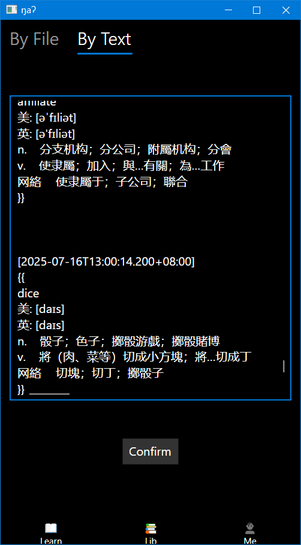
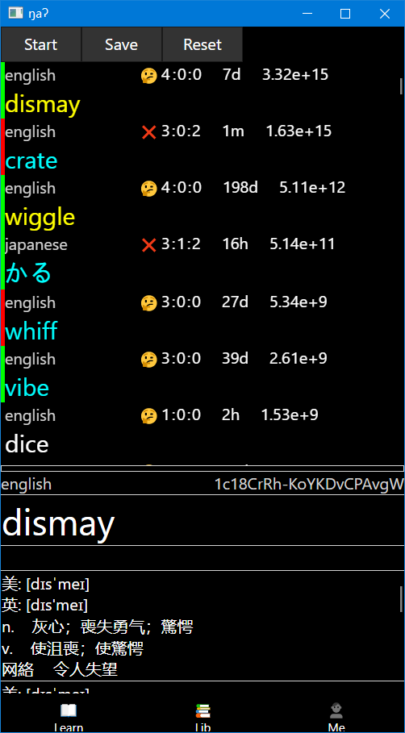

# CsNgaq

An app helps you remember vocabularies

Tech Stack:

-   Frontend: C#, Avalonia

-   Local Backend: C#, Sqlite,
    [CsSqlHelper](https://github.com/Tsinswreng/CsSqlHelper)

-   Server Backend(in progress): C#, Asp.net, EFCore, PostgreSql

Features:

-   client AOT-compatible

-   Support Windows, Linux, Android

# Try the app

Prerequisite:

-   OS: Windows/Linux

-   .NET9 installed

build and run:

1.  clone the repo including its sub repo

2.  run `./RunWin.sh`

# Word List Markup File

we use Word List Markup File to place the words and their meanings.
suppose when you are reading an article and there are some words you
don't know. you can look up the words in online dictionaies and copy the
words with its meaning into the word list markup file. then import the
word list file into the app. the app can parse it into word objects and
store them in the local database.

## Format

**comments are not allowed**. In order to make convenience for
introduction, here we use `#` as line comment mark

````` <metadata>
{
	"belong": "english" # the language the word list file belongs to
	,"delimiter": "````" # the delimiter used to separate word block
}
</metadata>

# time block
# the time represents for the add time for all the words in the tiem block
# add time will be used to calculate the weight/priority of the words when learning word
# only this kind of format(ISO 8601) is supported by now.
# the time zone is arbitary e,g +08:00. use `Z` for UTC.
[2024-07-27T16:48:19.795+08:00]
{{ # time block starts with {{ and ends with }}
triumph # the first line will be regarded as word head, which is used to identify words
# the rest of the lines will be regarded as description or say meaning
美: [ˈtraɪəmf]
英: [ˈtraɪʌmf]
v.	戰胜；成功；打敗
n.	巨大成功；重大成就；偉大胜利；喜悅
网絡	黛安芬；凱旋；獲得胜利
````
jubilation
美: [ˌdʒubɪˈleɪʃ(ə)n]
英: [ˌdʒuːbɪˈleɪʃ(ə)n]
n.	歡騰；歡欣鼓舞；歡慶
网絡	慶祝；歡呼；喜悅
[[tag|my custom tag]] # key-value pairs like this is supported.
# for more keys, see Ngaq.Core/Word/Models/Po/Kv/ConstPropKey.cs
````
fervent
美: [ˈfɜrv(ə)nt]
英: [ˈfɜː(r)v(ə)nt]
adj.	熱情的；熱忱的；熱誠的；熱烈的
网絡	強烈的；熾熱的；熱心的
````
fervid
美: [ˈfɜrvɪd]
英: [ˈfɜː(r)vɪd]
adj.	情感異常強烈的；激昂的；充滿激情的
网絡	熱情的；熱烈的；熾熱的

}}

[2024-07-27T21:40:15.717+08:00]
[[source|xxxxxx]] # you can add key-value pair here so that all the words in this time block can have the key-value properties
{{
# this word head(jubilation) has appeared in the previous time block
# in this case, this word will be regarded that it has been added twice in your word database
# the more the word appears, the higher the priority will be given to it
# if the same word appeared for many times but the add time is the same, it will only be added once
jubilation
美: [ˌdʒubɪˈleɪʃ(ə)n]
英: [ˌdʒuːbɪˈleɪʃ(ə)n]
n.	歡騰；歡欣鼓舞；歡慶
网絡	慶祝；歡呼；喜悅
````
clover
美: [ˈkloʊvər]
英: [ˈkləʊvə(r)]
n.	三葉草；車軸草
网絡	苜蓿；四葉草；幸運草

}}

[2024-07-28T16:13:25.195+08:00]
{{
crunch time
英 [ˈkrʌntʃ taɪm]美 [ˈkrʌntʃ taɪm]
關鍵時刻或關鍵時期（比如在比賽接近結束時），需要采取決定性的行動
````

}
 `````

# Word Weight Algorithm

The app use a weight algorithm to calculate the priority of each word
when learning. The main idea is to traverse the leaning records of each
words and dynamicly adjust the weight value based on the learning
records type (add, remember, forget) and its time.

the app has a built-in weight algorithm.

(in progress) you can also adjust the parameters of existing weight
algorithm or define your own weight algorithm. to create custom
algorithm, you need to implements the interfaces to make a executable
file and specify the path in the app settings. we will call it through
command line.

# Word Leaning page

after start, short click the word card represents for remembering the
word, long click for forgetting the word. click again is for undo. after
each rotate of leaning, click save to save your new leaning records in
the database and fresh the words weight

# Screenshots

 

# Server Backend (in progress)

-   User Management

-   word database remote sync
